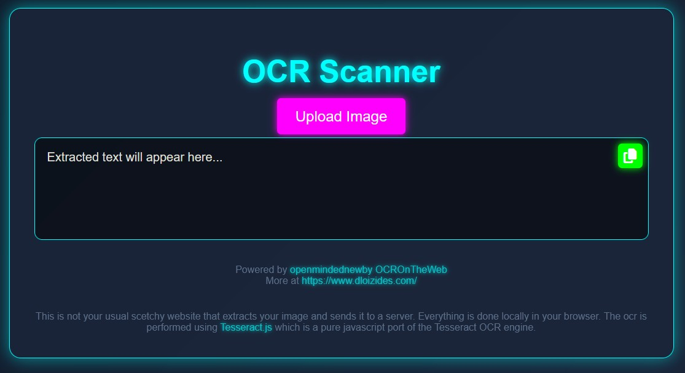

# QRCodeGenerator
Live on https://qr-code-generator.dloizides.com/

Free open source QRCode generator that runs on the browser using **QRCode.js** https://davidshimjs.github.io/qrcodejs/

## Addons

- ✅ Accessibility checked using WAVE https://wave.webaim.org/extension/
- ✅ OWASP OWASP ZAP (Zed Attack Proxy) is a free, open-source tool for finding vulnerabilities in web applications.
  - ✅ Content Security Policy (CSP)
    - Unfortunately had to use 'wasm-unsafe-eval' and 'unsafe-inline' for tesseract.js to work
  - ⚠️Missing Anti-clickjacking Header
  - ⚠️Server Leaks Version Information via "Server" HTTP Response Header Field
  - ⚠️Strict-Transport-Security Header Not Set
  - ⚠️X-Content-Type-Options Header Missing
- ✅ CEO
- ✅ PWA
